# Отчёт по лабораторной работе №3 «Функции в Python и базовые алгоритмы»

> **AI disclosure.** Код и этот отчёт подготовлены с помощью LLM (OpenCode / mimo-v2.6) по заданию методички. Запись в `log/ai-usage.md`. **Студент обязан разобрать каждый файл, сверить с методичкой и уметь объяснить каждую строку перед сдачей.**

## Среда выполнения

- ОС: Windows, оболочка: PowerShell
- Python 3.14.4 (`py --version`)
- Запуск: `py taskNN.py`; коды в корне папки, реальные выводы — в `output/taskNN.txt`, скриншоты — в `screenshots/`

## Ход работы (12 заданий)

### Задание 1 — создание и вызов функций
`greet(name)` печатает приветствие, `square(number)` возвращает квадрат, `max_of_two(a, b)` находит большее **без** встроенного `max()` (через `if`). Каждая функция вызвана дважды: `square(5)=25`, `square(-3)=9`, `max_of_two(5,3)=5`, `max_of_two(-2,-7)=-2`.

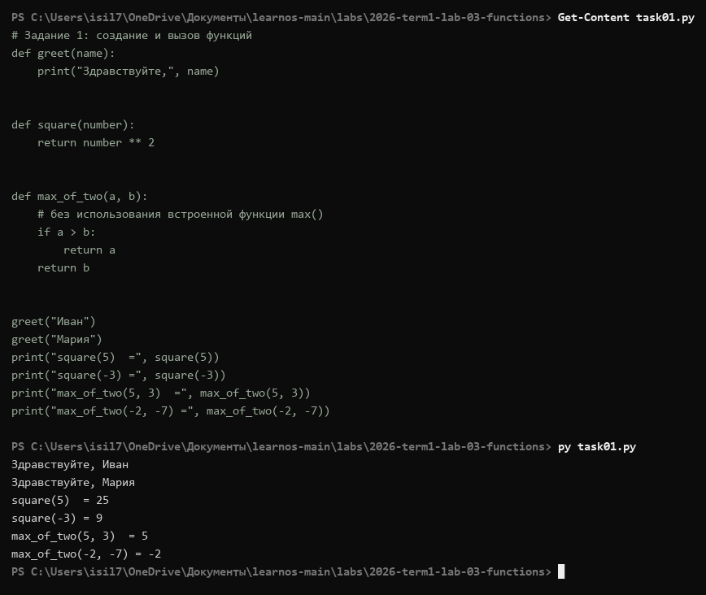

### Задание 2 — аргументы и возвращаемые значения
`calculate_rectangle` и `calculate_perimeter` возвращают результат; `describe_rectangle(width, height, unit="см")` демонстрирует значение по умолчанию: вызов без `unit` даёт «см», вызов `unit="м"` — «м». Площадь 5×3 = 15, периметр = 16; для 2.5×4 — 10.0 и 13.0.

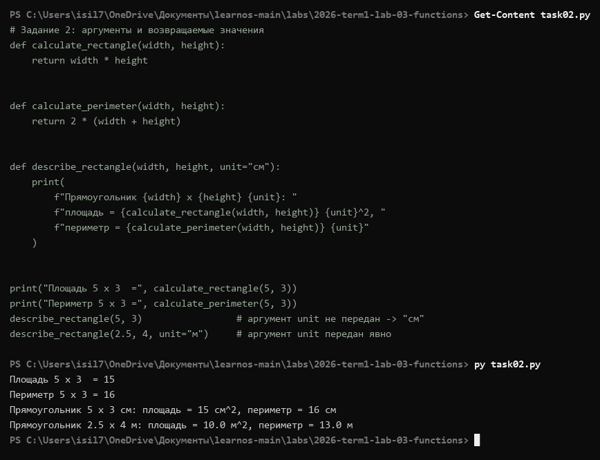

### Задание 3 — области видимости переменных
Вывод программы: `20` внутри функции и `10` снаружи — **локальная переменная `value` не меняет глобальную** с тем же именем. Обращение к `local_only` после завершения `demo()` даёт реальную ошибку `NameError: name 'local_only' is not defined`: область видимости локальной переменной ограничена телом функции.

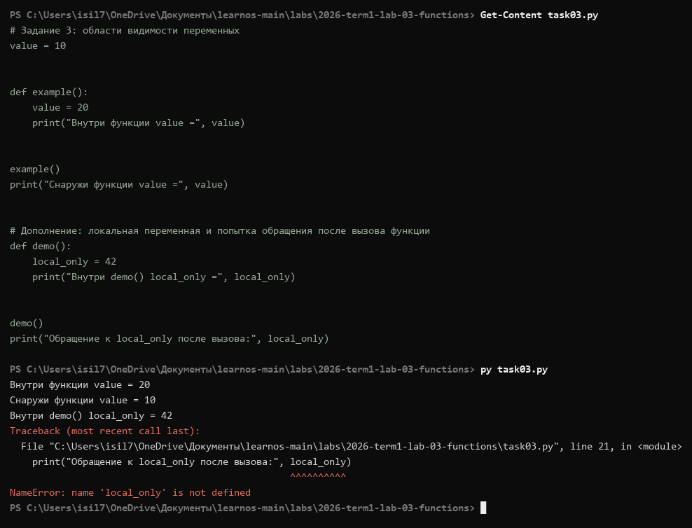

### Задание 4 — работа со списками
Исходный список из 10 элементов: первый `12`, третий `31`, последний `9` (отрицательный индекс). Изменение второго элемента, `append(55)`, `remove(31)`, `pop()` (извлечено `55`) — итоговый список из 9 элементов, `len() = 9`.

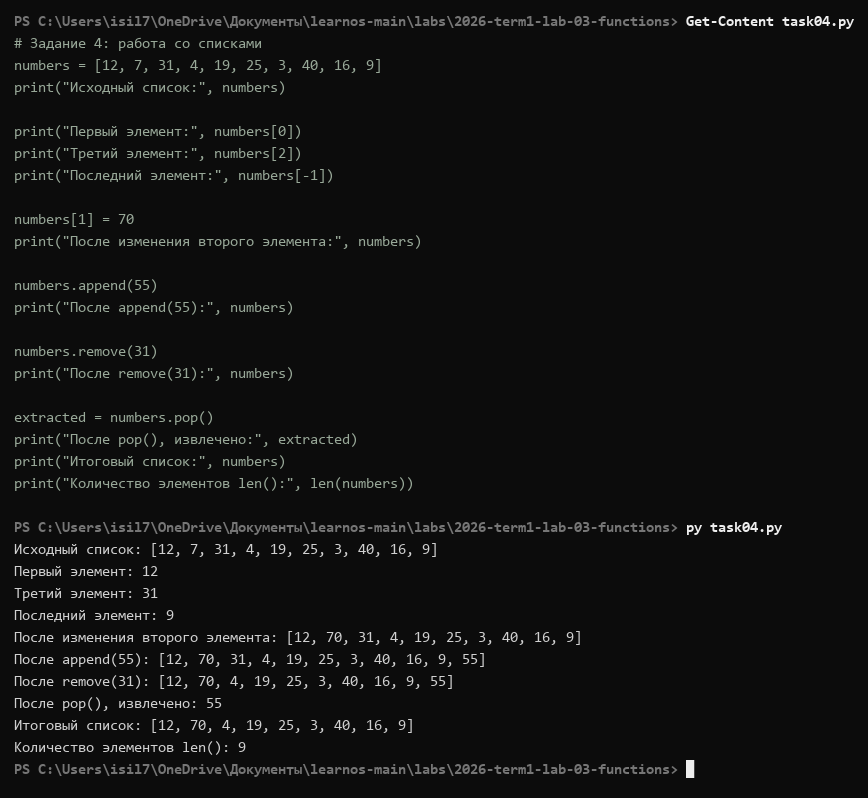

### Задание 5 — срезы
`[:3] → [1, 2, 3]`, `[-3:] → [8, 9, 10]`, `[2:7] → [3, 4, 5, 6, 7]` (третий–седьмой, `stop` не включается), `[::2] → [1, 3, 5, 7, 9]`, `[::-1]` — обратный порядок.

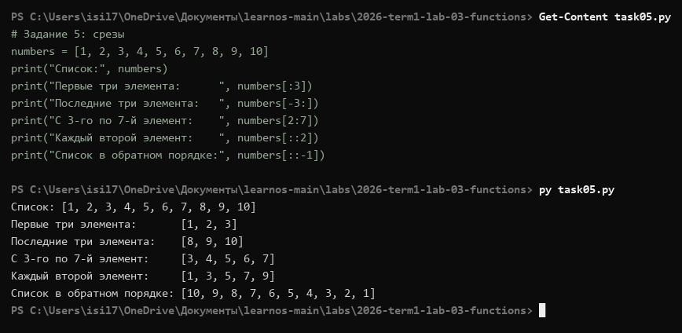

### Задание 6 — работа с кортежами
Индексация и срезы работают как у списка. Попытка `measurements[0] = 99.0` даёт `TypeError: 'tuple' object does not support item assignment` — **неизменяемость**. Распаковка `first, second, *rest` (осталось 6 элементов). Цепочка `tuple → list → tuple` позволяет изменить элемент: первый стал `99.9`, тип снова `<class 'tuple'>`.

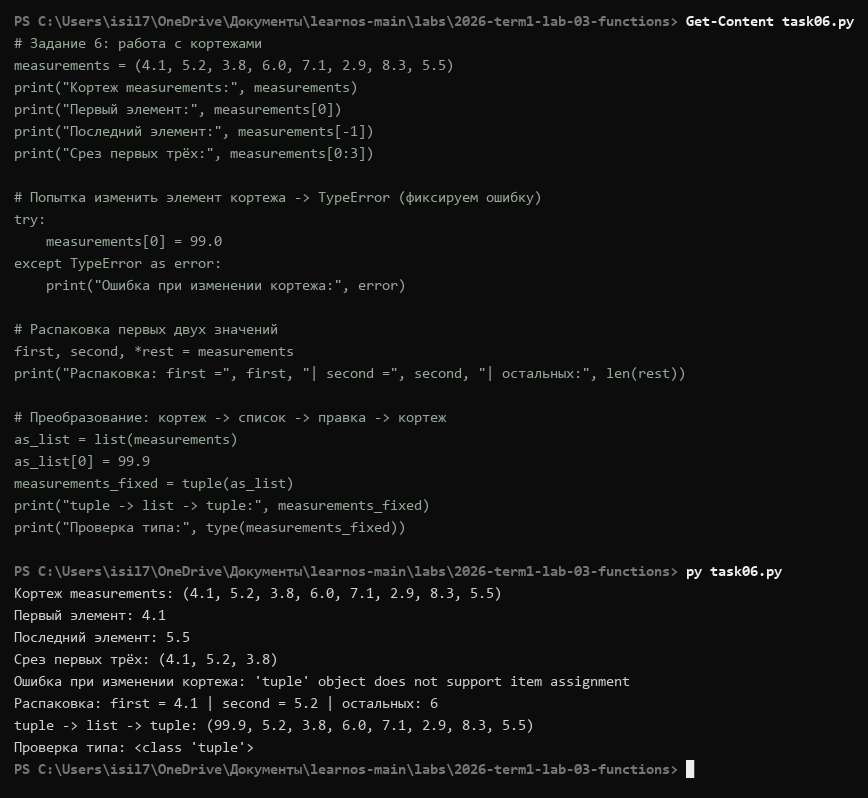

### Задание 7 — встроенные функции
`len=5`, `sum=29`, `min=2`, `max=10`, среднее `5.8`. Ключевое различие: `sorted(numbers)` вернул **новый** список `[2, 4, 5, 8, 10]`, а исходный остался `[5, 8, 2, 10, 4]`; после `numbers.sort()` исходный список **изменён на месте**.

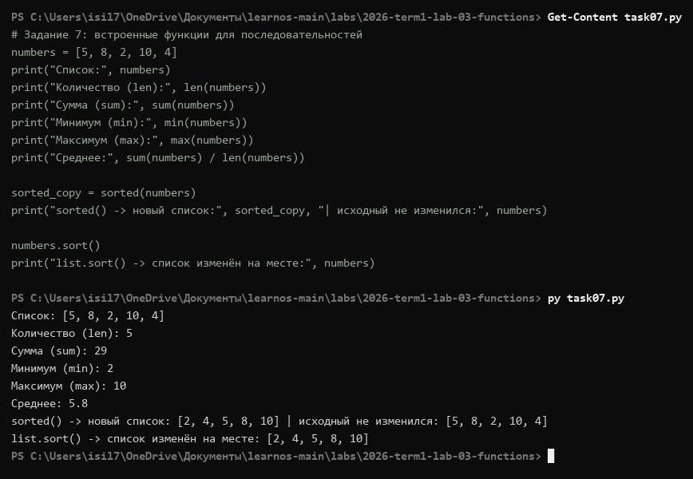

### Задание 8 — собственные алгоритмы
`calculate_sum`, `find_min`, `find_max` реализованы циклами `for` без `sum()/min()/max()`; перекрёстная проверка со встроенными: `29 | 29`, `2 | 2`, `10 | 10` — совпадает.

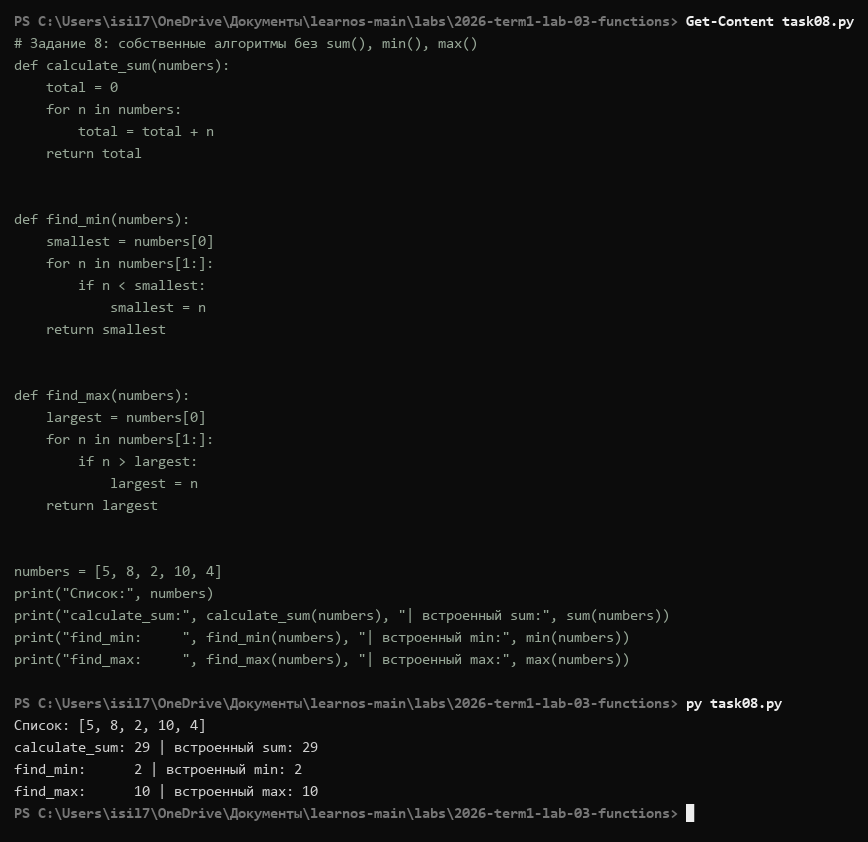

### Задание 9 — линейный поиск
`find_element` перебирает индексы и возвращает первый найденный, иначе `-1`: для `21` → `4`, для отсутствующего `99` → `-1` (ноль как индекс тоже валиден, поэтому «не найдено» кодируется `-1`, а не `0`).

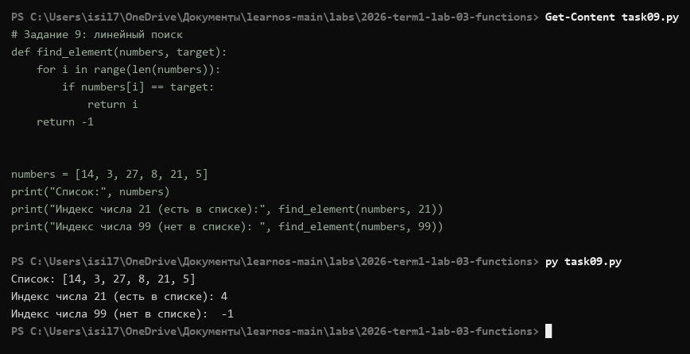

### Задание 10 — возврат нескольких значений
`analyze` возвращает кортеж `(минимум, максимум, среднее)` одной строкой `return a, b, c`; при вызове результат распакован в три переменные: `2`, `10`, `6.0`.

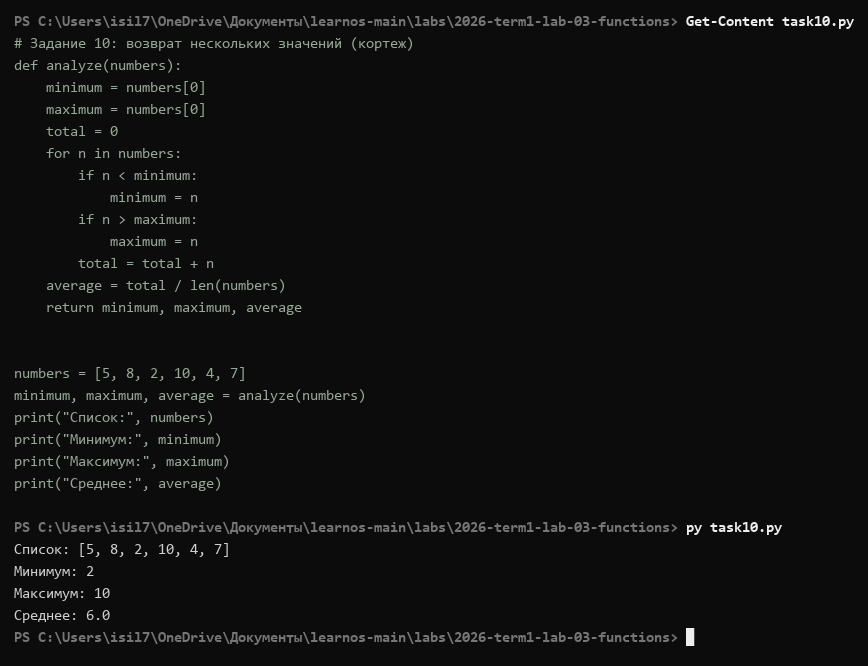

### Задание 11 — lambda-функции
Обычная сортировка `[-10, -5, -2, 3, 8]`; через `key=lambda x: abs(x)` — по модулю `[-2, 3, -5, 8, -10]`. Lambda задаёт **ключ сравнения**, не изменяя список и не переписывая функцию сортировки.

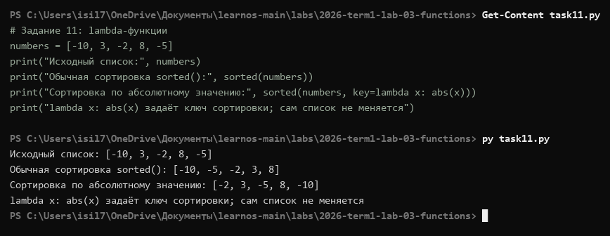

### Задание 12 — самостоятельная работа (анализ измерений)
Шесть функций: `calculate_average`, `find_minimum`, `find_maximum` (**без** встроенных `sum/min/max` — циклы и накопление), `count_above_average`, `find_value` (линейный поиск), `analyze_measurements` (возвращает кортеж, распакован). Ввод пользователя — значение для поиска (`6.4`). Результат: количество `12`, мин `2.7`, макс `9.8`, среднее `5.9917`, выше среднего — `6`, значение `6.4` найдено (индекс `5`).

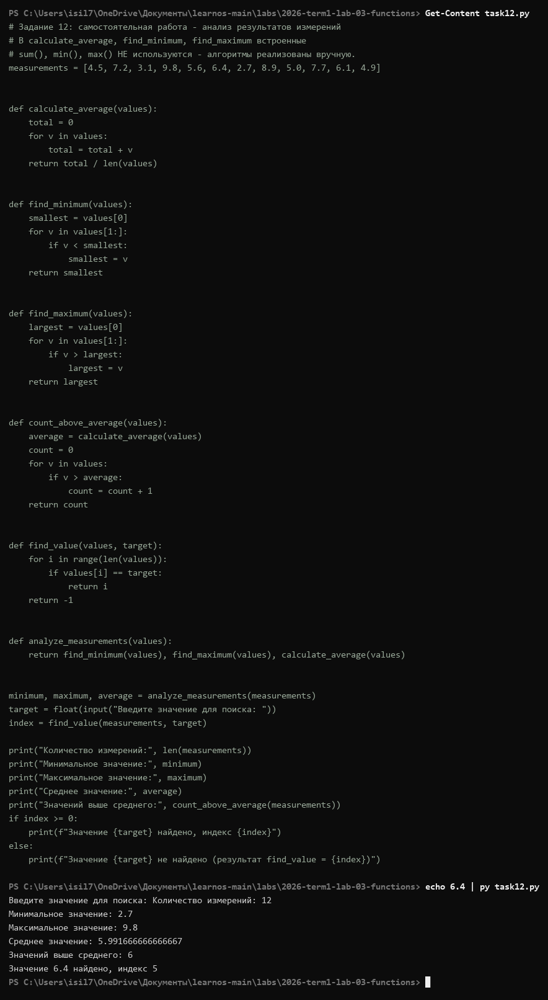

## Выводы

1. Освоены `def`, параметры/аргументы, значения по умолчанию, `return` vs `print`; показано на практике, что после `return` код не выполняется, а без `return` функция возвращает `None`.
2. Подтверждено поведение облаей видимости: локальная переменная не перекрывает глобальную, обращение после выхода из функции — `NameError`.
3. Разница изменяемых/неизменяемых структур показана реальными ошибками: `TypeError` на кортеже; разница `sorted()` / `sort()` — на выводе до/после.
4. Реализованы без встроенных функций: суммирование, минимум/максимум, линейный поиск (`-1` как признак отсутствия), подсчёт выше среднего.
5. Lambda применена как ключ сортировки — функция в Python является объектом и передаётся другой функции.

## Самопроверка

- [ ] Разобрать каждый `taskNN.py` построчно и объяснить без подсказок
- [ ] Сверить формулировки с методичкой (PDF стр. 39–53)
- [ ] Ответить на контрольные вопросы самопроверки из методички
